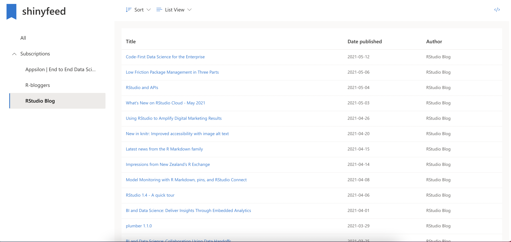
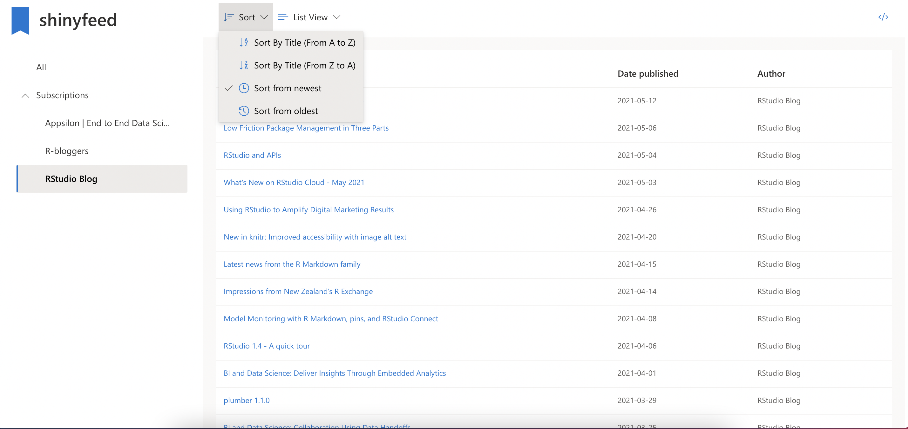

# shinyfeed

The app is available at https://rszymanski.shinyapps.io/shinyfeed/

## Short Description

`shinyfeed` is a personalized news feed in the form of a Shiny app. Keep all of your news in a single place!

## Full Description

`shinyfeed` is an application that aggregates news from different sources. It makes use of RSS feeds to retrieve posts and displays them in a single view.

`shinyfeed` provides a grid view which displays items along with an image preview. The tool used to retrieve image previews is built using `rvest` and makes use of the [Open Graph Protocol](https://ogp.me/).


For a more compact view of the posts users can also display items in form of a list



Users can also sort items by titles and publication dates:



### Installation

This project makes use of `renv` in order to export used dependencies and `rsconnect` for deployment. When opening the project R should automatically download the specified version of `renv`. Next in order to restore the used packages just run:

```r
renv::restore()
```

To start the app run:

```r
shiny::runApp()
```

### Configuration

Users can host their own aggregated news feeds by specifying rss feeds in the `config.yml` file:

```yml
default:
  rss_feeds:
  - "https://appsilon.com/rss"
  - "https://blog.rstudio.com/index.xml"
  - "https://www.r-bloggers.com/feed/"
```

The version hosted on shinyapps is an example news feed that aggregates post from different blogs about R and Shiny.